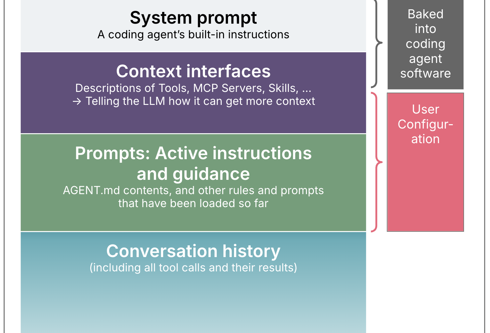
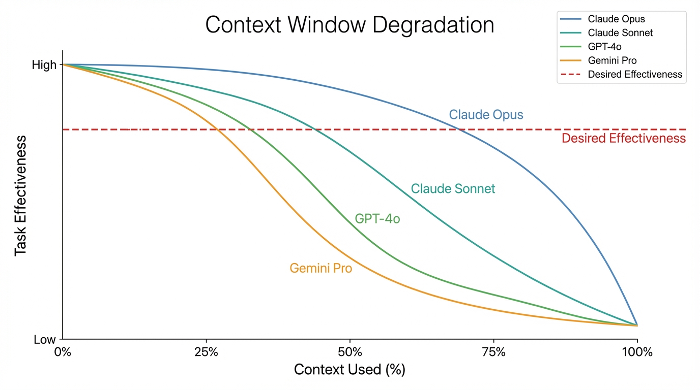
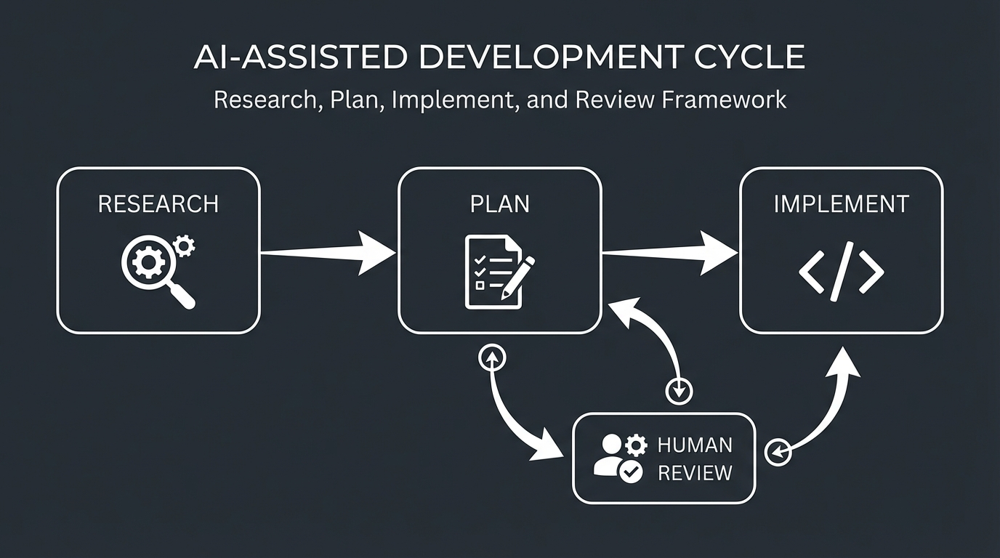
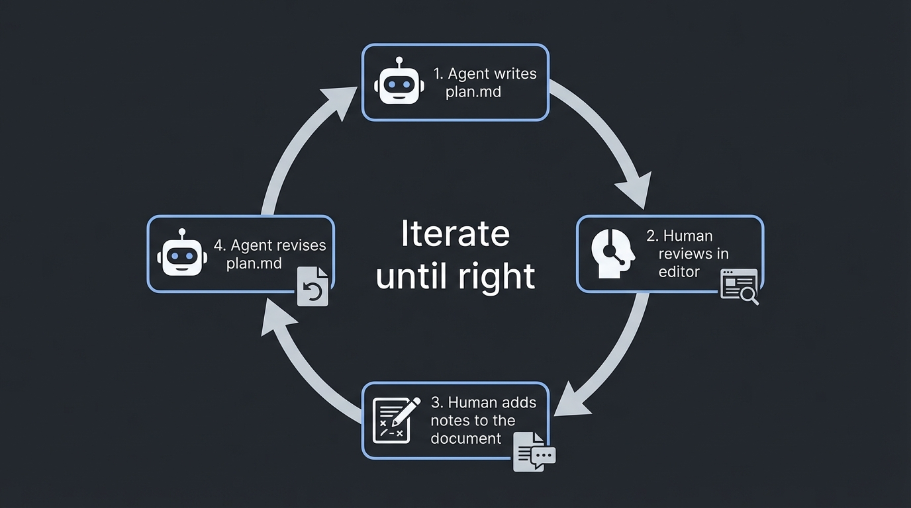
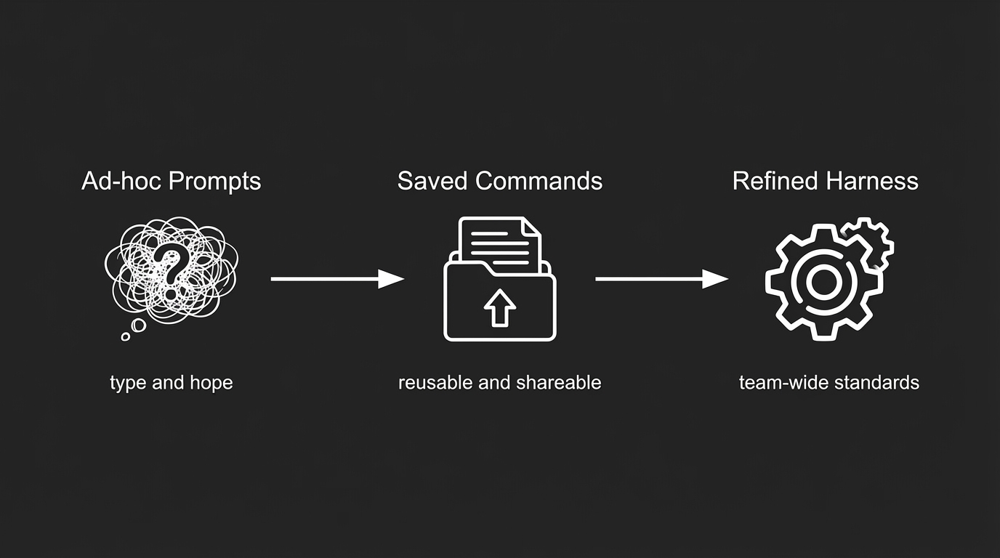

<!-- _paginate: false -->
<!-- _footer: '' -->

# AI Workflows for Development


---
## Who am I?
Matt Bailey, staff engineer for RTO.

---

## What Is This?

- Workflow patterns and tooling concepts
- Live demos?
- All slide material available at: `https://github.com/breeze4/ai-workflows`

---

## What This Isn't

- No magic prompts to copy/paste
- The single way that everyone should work forever
- Predictions about where AI workflows will be in 6 months

---
<!-- _footer: '' -->

## Questions — Any Time


Scan or go to **slido.com**

Code: **#4056285**

Ask throughout. Will address them as we go.

---

## Where are you at?

Raise your hand if...

- You've used any AI coding tool (Copilot, ChatGPT, etc.)

---

## Where are you at?

Raise your hand if...

- You've used any AI coding tool (Copilot, ChatGPT, etc.)
- **Keep it up** if you use it daily

---

## Where are you at?

Raise your hand if...

- You've used any AI coding tool (Copilot, ChatGPT, etc.)
- **Keep it up** if you use it daily
- **Keep it up** if you've used an agentic tool (Cursor, Claude Code, Codex)

---

## Where are you at?

Raise your hand if...

- You've used any AI coding tool (Copilot, ChatGPT, etc.)
- **Keep it up** if you use it daily
- **Keep it up** if you've used an agentic tool (Cursor, Claude Code, Codex)
- **Keep it up** if you've customized your agent (commands, skills, CLAUDE.md)

---

## Where are you at?

Raise your hand if...

- You've used any AI coding tool (Copilot, ChatGPT, etc.)
- **Keep it up** if you use it daily
- **Keep it up** if you've used an agentic tool (Cursor, Claude Code, Codex)
- **Keep it up** if you've customized your agent (commands, skills, CLAUDE.md)
- **Keep it up** if you've run multiple agents in parallel or autonomously

---

## One-shot workflow

Tell the AI what you want. Hope for the best.

- Fixes the test instead of the bug
- Works in isolation, breaks in context
- Misses conventions, burns tokens backtracking
- You spend more time fixing than you saved

---

## The Manual Workflow

Where everyone starts. Prompt, read output, steer, repeat.

- All coordination lives in your head
- Nothing reusable, nothing persists across sessions
- Context fills up, you start over from scratch

We can do better! But there's a problem...

---
<!-- _footer: '' -->
<!-- _class: center -->



---

### The problem with memory:

Storing your shopping list in your head - if you try to remember too many items, you will start forgetting to buy things!


---

<!-- _footer: '' -->

If you look up "context rot" you find many graphs that look like this:



---

<!-- _paginate: false -->
<!-- _footer: '' -->

# Context Engineering

---

Think of context as the agent's memory for a single message at a time.

---

## Files as Shared Memory

Agent quality drops as context grows. Write everything to disk.

- research.md - what exists
- plan.md - what to do and why
- Progress tracked inline

Files are the memory. Chat is disposable.

---

<!-- _footer: '' -->



Each step writes to a file. Review before moving on. Context can be cleared between phases without losing work.

---

## Research

Agent reads code, writes findings to a file. Observation only.

Ask for: how things work, code references, conventions, edge cases.

Do not want: suggestions, priorities, estimates.

If it's incomplete, say what's missing and run it again.

---

<!-- _footer: '' -->



The plan file is the source of truth. The chat context is used to refine the plan.

---

## Implement

Work the plan. Mark items done. Verify each step.

Implementation should be boring.


---

## Demo

```
cd examples/research-demo
```

> Read the CLAUDE.md and the code in this project.
> Research how the app works and write findings to docs/research.md.
> Do not suggest changes — only document what exists.

<!--
PRESENTER NOTE — Research Demo

1. Open examples/research-demo in your agent
2. Give it the prompt shown on the slide
3. Let it run — it will read files one at a time
4. Review docs/research.md when it finishes

Key talking point: this works, but one agent reads every file sequentially.
Later we show how to split this into parallel subagents.
-->

---

<!-- _footer: '' -->

## AGENTS.md: Bad vs Good

| Bad AGENTS.md (Wall of Text) | Good AGENTS.md (Routing Table) |
|---|---|
| One giant manual covering everything | Short navigation map with links |
| Setup instructions buried in long prose | `Quick Start`: `npm install && npm run build` |
| Build commands mixed into paragraphs | `Build`: `npm run dev` (local), `npm run prod` (production) |
| Troubleshooting mixed with architecture | `Troubleshooting`: `docs/troubleshooting.md` |

--- 
Keep AGENTS.md scannable: commands, constraints, and pointers.

Every line costs tokens on every request. Keep it small.

- Essentials, build commands, pointers to deeper docs
- Nest docs next to the code (src/auth/README.md)
- Don't use auto-generated AGENTS.md files - **I used to do this until this week and I regret it!**

---

## Presenting AI-Assisted Work

Your name is on it. #OwnIt

- If you didn't read it, don't send it
- If you can't explain it, don't present it
- Show working prototypes and verified findings, not raw agent output
- "I used AI to help build this" is credible. Forwarding unreviewed artifacts is not.

The test is simple: could you defend every line in a code review?

---

## What to Show, What to Keep to Yourself

| Present | Don't Present |
|---------|---------------|
| Working prototype you've run and tested | Generated code you haven't executed |
| Research findings you've cross-checked | Copy-pasted agent analysis |
| Plan you've heavily edited and prepared for human consumption | Design doc straight from the agent |
| Live demo of the thing doing the thing | Screenshot of a chat conversation |

If someone asks "why did you do it this way?" you need an answer that isn't "AI wrote it."

---

<!-- _paginate: false -->
<!-- _footer: '' -->

# Level Up

---

<!-- _footer: '' -->



- Prompt works? Save it as a command. Improve over time.
- Falls short? Add constraints, format rules, scope limits.
- Share to team or check into the codebase.

---

## CLI Tools as Control Planes

Agents can run every CLI you already use.

| Tool | Example |
|------|---------|
| `gh` | CI logs, PRs, issues |
| `jira` | Descriptions into tickets |
| `kubectl` | Pod configs, logs, cluster state |
| `aws` / `az` | ClickOps resources into IaC |
| `docker` | Build, inspect, debug |

Dry-run first. Read every command. Own every output.

---

## Hooks

Automated checks the agent will not skip or forget.

- PreToolUse — runs before the agent acts.
- PostToolUse — runs after the agent acts.
- Notification — fires when the agent needs input.

Every major agent tool supports hooks now:
- Claude Code — docs.anthropic.com/en/docs/claude-code/hooks
- Cursor — cursor.com/docs/agent/hooks
- Codex — github.com/openai/codex

---

## Turn Preferences into Hooks

> "Read my AGENTS.md. Find style and safety rules.
> Generate hooks that enforce them automatically."

- Formatting preferences -> PostToolUse linting hooks
- Safety constraints -> PreToolUse blockers
- Commit them to `.claude/settings.json` so they survive across workspaces


---

## Subagents

Parallel research across slices, merge into one report. Ask your agent to do this for you on any task.

- Split work by module, feature, or question
- Parent agent merges results into a single deliverable
- 5x research in the same wall-clock time
- Multiple agents are good at reading code, but don't do this for writing code!

---

## Worktrees

Isolated directories per agent. No file conflicts. Ask your agent to manage it for you!

- `git worktree add ../feature-branch feature-branch`
- Each agent gets its own working copy
- No merge conflicts mid-task
- Clean up when done: `git worktree remove ../feature-branch`

---

## Ralph Loops


The plan file is the control structure.

- Inner script: pick a task, implement, verify, write to progress log
- Outer script: run inner, check, continue or stop
- Agent loops until the plan is complete
- You review the output, not the process

Warning: this can be a REALLY REALLY bad idea!!! Use it for learning and personal projects, but requires extreme care for Axon. Mistakes add up quickly!

---

## Build Your Own Loop

Don't hand-write loop scripts for each project.

Make a skill that generates them. Each new project gets a loop tuned to its build and test setup

Tip: for ralph environments, use Docker or Vagrant to give each agent a clean, reproducible workspace.

---

<!-- _paginate: false -->
<!-- _footer: '' -->


## Repository as Source of Truth

If it's not in the repo, it doesn't exist.

- Specs, plans, and architectural maps go in the repo
- Structured markdown, versioned with the code
- Use MCPs/APIs to get data and then put that into the repo.

---

<!-- _paginate: false -->
<!-- _footer: '' -->

# Wrap Up

---

## What to do now

1. Research, plan, then implement.
2. Write to files. Chat is disposable.
3. Context management is simple, but not easy.
4. Build commands. Improve them over time.
5. Automate your standards.
6. Agent struggling? Fix the environment.
7. Read every output. You are the engineer.

---

## Resources

- OpenAI: "Harness Engineering" — openai.com/index/harness-engineering/
- Birgitta Böckeler: "Harness Engineering" — martinfowler.com/articles/exploring-gen-ai/harness-engineering.html
- Boris Tane: "How I Use Claude Code" — boristane.com/blog/how-i-use-claude-code/
- Axon AI Kit — github.com/axon-platform/ai-kit
- This repo — github.com/breeze4/ai-workflows
- HumanLayer - https://github.com/humanlayer/humanlayer/tree/main/.claude/commands
- Geoffrey Huntley - https://github.com/ghuntley/how-to-ralph-wiggum
